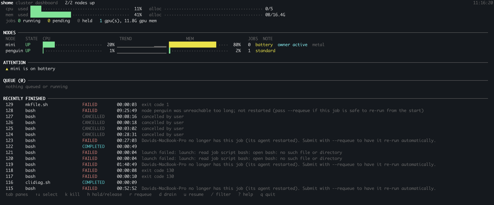
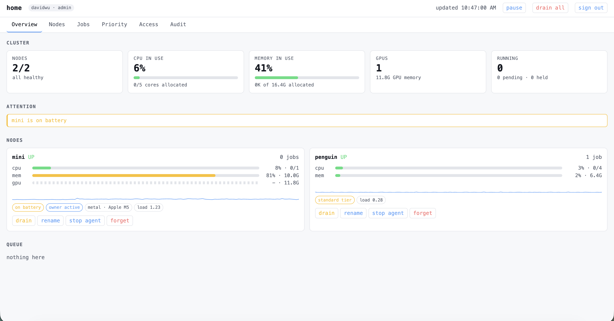
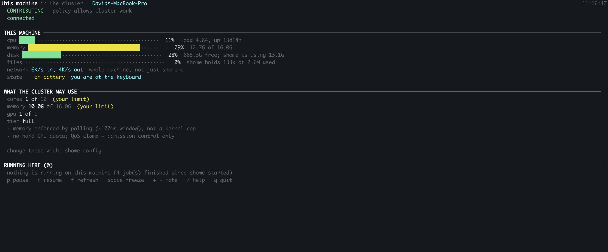

# shome

**s**lurm + **home**: run the computers you already own as one cluster.

Shome helps you utilize all of your home computers, lab computers, and old computers to form a unified cluster, in a managed way. Shome takes care of scheduling, storage, resource allocation, priority, acceleration, and security, so you can focus on running your compute jobs. You can even try handing off your local cluster to an agent.

```console
$ shome sbatch --gres=gpu:1 --mem=8G --time=2:00:00 train.sh
Submitted batch job 41

$ shome squeue
JOBID  NAME      USER   STATE    TIME      CPUS  MEM(MiB)  GPUS  NODE
41     train.sh  alice  RUNNING  00:01:12  1     8192      1     studio
```

---

## Requirements

**To build**, on the machine you build from:

| | |
|---|---|
| Go 1.25 or newer | `brew install go`, or <https://go.dev/dl/> |

That is the only hard build requirement. `install.sh` also cross-builds the
Linux agents the controller hands out when a machine joins; on macOS it
cross-builds the other Mac architecture too, which needs the Xcode command
line tools (`xcode-select --install`). 

**To run a controller**, on whichever machine coordinates:

| | Why |
|---|---|
| macOS or Linux | Windows is not implemented |
| an inbound port, 7817 by default | agents dial the controller, so only this machine needs to be reachable |

**To run jobs on a Mac:**

| | Why | Without it |
|---|---|---|
| Apple silicon, macOS 26+ | the container runtime sessions and non-GPU jobs use | GPU jobs still run; sessions are refused |
| [`apple/container`](https://github.com/apple/container/releases), then `container system start` | one lightweight VM per job or session | the machine refuses sessions rather than running them unconfined |
| Rosetta (`softwareupdate --install-rosetta`) | the runtime's *image builder* runs as x86-64 even on an M-series Mac | sessions work with uv and the shome commands, without the base software set |
| Xcode command line tools | GPU jobs run natively and use the machine's own `git`, `curl` and friends | `shome admin env status` reports them missing |
| Local Network permission for your terminal | recent macOS blocks reaching machines on your own network | joining fails *instantly*, on a Mac whose internet is fine |
| Full Disk Access (optional) | managing per-account home directories | one warning from `shome doctor` |

> **The Local Network permission is the single most likely reason a Mac will
> not join.** System Settings → Privacy & Security → Local Network, enable
> Terminal or iTerm, then quit and reopen it. The tell is that the failure is
> instant and the same Mac browses the web perfectly, so it reads as a firewall
> or router problem and is neither.

**To run jobs on Linux:**

| | Why | Without it |
|---|---|---|
| bubblewrap (`apt install bubblewrap`) | confining a job to its own directory | **the node drains itself and says so.** It will not run other people's code unconfined |
| cgroup v2, delegated | kernel-hard memory and CPU limits | the node reports a lower enforcement tier; memory is polled instead |
| Landlock (optional) | defence in depth on top of the mount namespace | nothing; the namespace is the boundary |
| passwordless root or sudo (optional) | a node installs the cluster's base software when it joins | the node says what to install by hand. `SHOME_NO_PROVISION=1` turns it off |
| `nvidia-smi` (optional) | GPU utilisation in the dashboard | a dash instead of a number |

**For multi-user features:**

| | Why |
|---|---|
| `uv` on the controller | `shome admin env install` copies the uv already there rather than downloading one. Deliberately not a download: fetching and running a binary from the network on a machine somebody lent you is not shome's decision to make |
| port 2222 | the SSH login node, if you want people signing in |

## Install

```bash
git clone <this repo> && cd shome
./install.sh                  # to ~/.local/bin
./install.sh /usr/local/bin   # or wherever
```

## Start a cluster

On whichever machine should coordinate (ideally one that is usually on):

```bash
shome up
```

It starts the controller and this machine's agent in
the background, picks a state directory, binds every interface, writes its own
log and pid file, and prints where everything is.

```bash
shome doctor     # anything wrong with this installation?
shome top        # live dashboard
shome down       # stop
```

## Add a machine

On the controller:

```bash
shome invite            # or: shome invite mini, to name it
```

It prints one line. Run that line on the machine you are adding:

```bash
curl -fsSL http://192.0.2.10:7817/j/<token>/install | sh
```

That downloads the right binary for that machine, joins the cluster, and starts
running jobs. The token is single-use and expires in 30 minutes.

After the first join that machine needs no arguments ever again: `shome up`
there remembers it is an agent and which cluster it belongs to.

If a machine will not join, `shome doctor` on either end names what is broken.
On a Mac it is almost always Local Network permission: System Settings →
Privacy & Security → Local Network, enable your terminal, then reopen it.

**Note: The machine's owner outranks the cluster admin**.

```bash
shome pause "stepping away"    # running jobs suspend; no network call needed
shome config set contribute.max_cores 6
```

Around those: per-job sandboxing on every platform, multi-user accounts with an
embedded SSH login node, files that name the machine they live on because there
is no shared filesystem, and an uninstall that is a directory removal.

Slurm's `sbatch`, `squeue`, `scancel`, `sinfo`, `sacct` and `scontrol` are
available under their own names via `shome shims install`, `#SBATCH` directives
are honoured, and `SLURM_*` environment variables are set.


## Stop and remove

```bash
shome down               # stop shome here; state is kept
shome nuke               # show exactly what would be removed
shome nuke --confirm     # remove it, then prove it
```

`nuke` stops the daemon and removes shome.

## Main commands

```bash
shome sbatch job.sh                       # queue it, walk away
shome srun python train.py                # run now, watch output, get its exit code
shome srun --pty bash                     # an interactive shell on a compute node
shome squeue                              # what is queued and running
shome sinfo                               # the machines, and how real their limits are
shome squota                              # what you are using, and what you may use
shome top                                 # live dashboard (browser version on 7820)
shome monitor                             # what the cluster is doing to *this* computer
shome fs cp ./dataset mini:               # move whole directories between machines
shome plan --total-gpu-mem 40G            # what would run this, without submitting
```

`shome sbatch --constraint "metal&gpu_mem>=12G"` targets capability rather than
hostname, which is the only thing that works in a cluster of mismatched
machines.

## Monitoring

Two views over the same data, both live, both able to act on the cluster.

```bash
shome top          # in the terminal
shome web          # print the browser URL and your token
shome web --open   # and open it
```

`shome top` is a full-screen dashboard: cluster totals, the machines, and the
queue.  It is interactive: `tab`
switches panes, `↑↓` selects, `k` kills a job, `h` holds or releases one, `d`
and `u` drain and resume a machine, `/` filters, `?` lists the rest.



`shome web` runs on the controller and prints a URL and your API token to paste:



For what the cluster is doing to *one* machine, use
`shome monitor`.



## Documentation

| | |
|---|---|
| [docs/scheduling.md](docs/scheduling.md) | how a job gets placed, what you ask for, queue order, what happens when a machine goes away |
| [docs/jobs.md](docs/jobs.md) | batch, foreground and interactive jobs; arrays and dependencies |
| [docs/software.md](docs/software.md) | the software a job gets, and adding your own with uv |
| [docs/storage.md](docs/storage.md) | storage is per machine and per account; moving files between machines |
| [docs/limits.md](docs/limits.md) | what you may ask for and use, and `squota` |
| [docs/monitoring.md](docs/monitoring.md) | `squeue`, `sacct`, `sinfo`, `shome top`, `shome web` |

## Maturity

Working end to end on macOS: batch jobs, arrays, dependencies, DAG pipelines,
per-job sandboxing, memory and time limits, multi-node gang scheduling verified
across two physical machines on different operating systems, aggregate
placement, multi-user accounts with sandboxed login sessions, GPU work under
MLX and PyTorch MPS, whole-directory transfers, `srun` with a live terminal,
fair-share priority and backfill, owner controls, resident services, and a
dashboard in both the terminal and a browser. Linux is validated on ChromeOS/Crostini (x86-64, cgroup v1, unprivileged). Windows is not supported. Multi-node jobs are not fully supported.

## Testing

```bash
go test ./...                     # around 600 test functions
python3 sdk/python/test_shome.py
./examples/run-all.sh             # every workflow against a throwaway cluster
```

## License

MIT, see [LICENSE](LICENSE).
